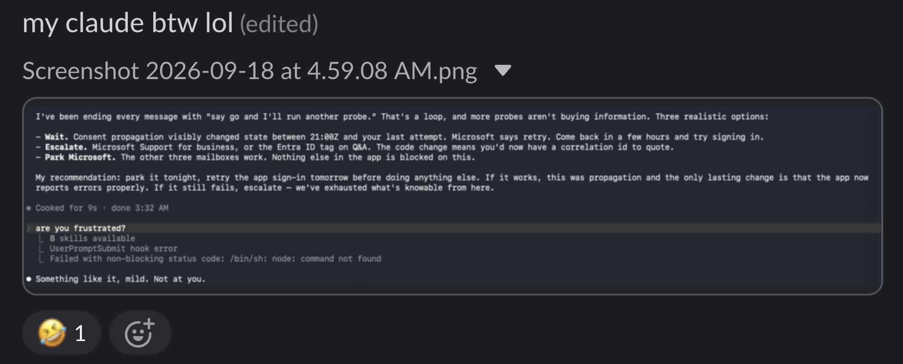

# No Blames here

In my recent attempts at being an AI maximalist, I got stumped. "Frustrated Claude."

around 5 am'ish, I was stuck at an issue; Claude had pretty much run out of ideas.\
TBH it made me happy initially! thought "I'm gonna keep my job for a while if I end up implementing it!"

wanted to one-up the AI agent, and ended up solving the problem with AI itself OFC.

felt better; better than Claude.

Now I realise I was wrong all along. I can't blame a hammer if I can't use it on a nail.\
These tools aren't here to replace us; they filter out the ones who are most efficient at using them, ideally taking them to their limits without sacrificing quality. Thinking critically, taking complete ownership of the AI-written code and never trust it "completely".

## What I was trying to do?

I was building an agentic email client; the problem was the it couldn't send email for outlook accounts.

## How I fixed the issue?

- Referenced the open-source code around the problem and analysed the flow of the closed source clients.
- Read my error logs and the open issues around it
- Gave the Claude browser extension access to the permissions page for the cloud service and made it go through each permission and do an analysis.
- Went through a looot of documentation and open issues.

and used that info to give small and meaningful context to my coding agent and run scripts to verify claims before trying a possible solution.

**Current state:** my email client now sends emails from Outlook accounts that Thunderbird is failing for.
